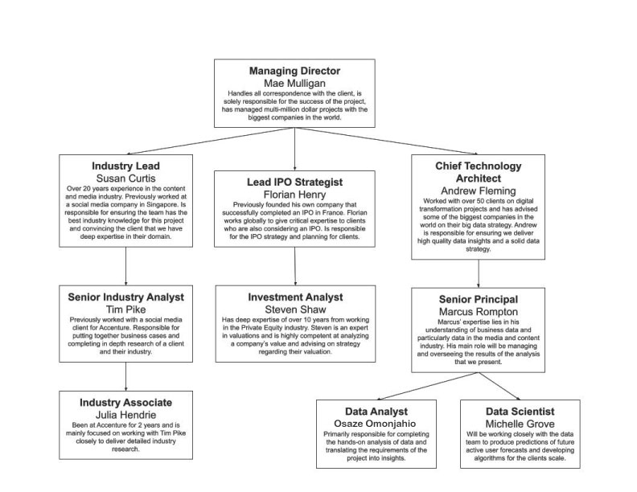
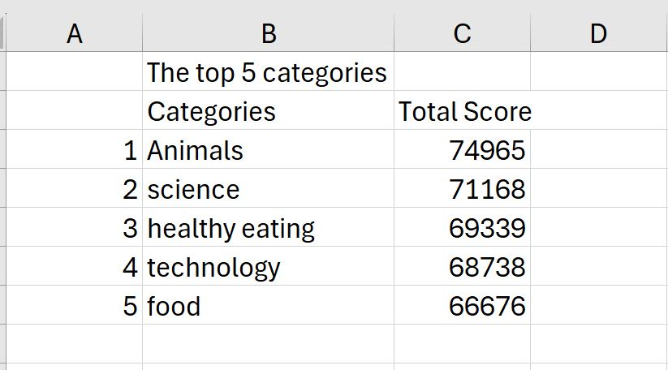
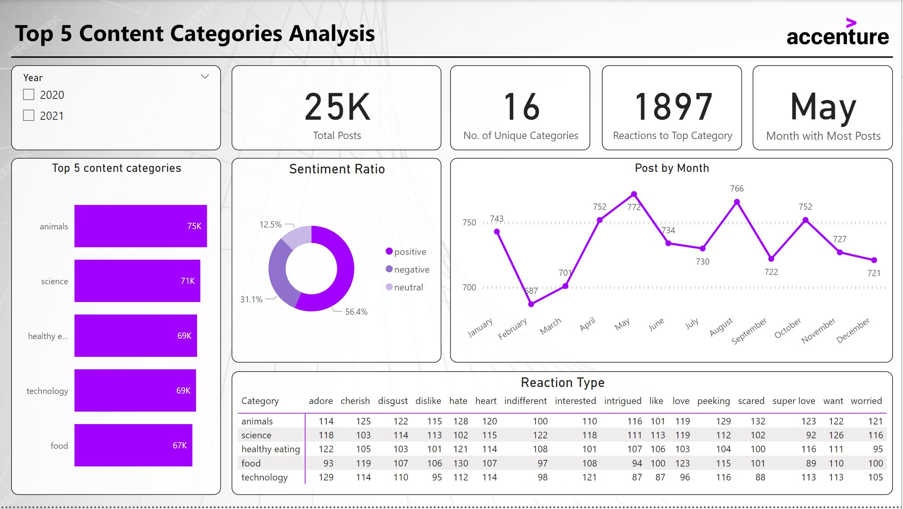

# Accenture-Internship---Navigating-Numbers

## Overview

This project revolves around working as a data analyst in the capacity of a technology delivery analyst at Accenture. As a data analyst, my primary focus was to swiftly grasp the project's essence to provide context to the client's overall objective. The main tasks involve:

**Understanding the Client Brief:** Begin by thoroughly reviewing the client brief to gain insight into the client's background, the prevailing business issue, and the project's key objectives.

**Analyzing Background Information:** Delve into the provided background information to identify the specific requirements expected from a data analyst within this project.

**Task Assignment:** Identify and allocate tasks that align with the project's deliverables, ensuring synergy and alignment within the Accenture team.

## Evaluation Criteria

My performance was evaluated based on:

**Business Problem Outline:** My comprehension and outline of the core business problem articulated in the client brief.

**Deliverable Requirements:** Accurate identification of the requirements essential for delivering as a data analyst on this project.

**Task Delegation:** Effectively allocating tasks to ensure coordinated team efforts and project alignment.

.
As a Data Analyst at Accenture, 1 operates within a multifaceted team, each member holding distinct roles and varying degrees of responsibility. My team was tasked with a new project for a client named Social Buzz. This project presented an exhilarating opportunity for me to exhibit my expertise in data analysis and visualization.

## My Roles and Responsibility as a Data Analyst at Accenture

As a Data Analyst, my role bridges the gap between the business aspects and the data itself. This position involves interpreting and translating data insights for both clients and internal team members, facilitating informed strategic decisions. Effective communication of data findings simply and is crucial, considering that not everyone possesses a strong grasp of data intricacies. My primary tasks include cleansing, processing, and utilizing relevant data sources to derive valuable insights for business use. Working at Accenture exposed me to diverse clients and projects, ensuring a dynamic work environment with constant learning opportunities. The nature of the job often demands accuracy within tight deadlines, necessitating swift adaptation to new projects.

## Social Buzz Project Brief

[Download Social Buzz Project Brief](https://drive.google.com/file/d/1BjaiB6gOwlECGmnr9BPPWxSa24v2GjGl/view?usp=sharing)

Based on the project brief, it's evident that the client has experienced significant growth in recent years, leading to a substantial scale that surpasses their internal resource capacity. Consequently, they've engaged Accenture to conduct an audit of their big data practices, provide IPO recommendations, and perform an analysis of popular content.

## Project Kick-off Meeting:

During the project kick-off meeting, the project team was introduced, allowing everyone to meet each other and understand their respective tasks and responsibilities.

## The Data

The client shared:

- 7 distinct data sets, each containing various columns and values.
- A data model illustrating relationships among the data sets and any connections available for merging tables.

## Requirements gathering

The first step is to use this [data model](https://drive.google.com/file/d/1wFJ0WmxaFikMixGMgQ7PpkW8A03PdfKq/view?usp=sharing) to identify which datasets will be required to answer the business question - which is to figure out the top 5 categories with the largest popularity.

From the data Model, the three data sets I needed to complete my analysis where
- Reaction
- Content
- Reaction Types

To clarify why I made this selection:

- The brief carefully states that the client wanted to see “An analysis of their content categories showing the top 5 categories with the largest popularity”.
- As explained in the data model, popularity is quantified by the “Score” given to each reaction type.
- I therefore needed data showing the content ID, category, content type, reaction type, and reaction score.
- So, to figure out popularity, we’ll have to add up which content categories have the largest score.

## Data Cleaning(Performed in Microsoft Excel)

**Content Dataset**

- The URL and User ID columns were deleted because it was not needed for the analysis
- Using the filter function in Excel, some data inconsistencies in the category column were noticed and handled.
- The Type column was renamed to Content Type for consistency with the other datasets

**Reaction Dataset**

- The Type column was renamed to Reaction Type for consistency with the other datasets
- The user ID column was deleted because it was not needed for the analysis 
- Rows with blank values in the type column were deleted to maintain integrity in the analysis. 

**Reaction Dataset**

- The Type column was renamed to Reaction Type for consistency with the other datasets

## Data Modelling

To finalize my data modeling, I merged three tables to create a comprehensive dataset. Initially, I used the reaction table as the primary table, linking relevant columns from the content dataset and subsequently from the reaction types dataset using the 'VLOOKUP' formula. Then, employing the "SUMIF" formula, I calculated the total scores for each category. This process led to a refined dataset highlighting the top 5 categories based on the accumulated scores.

## Data Analysis / Data Visualization & Storytelling

I'm aware that the client is eager to uncover the top 5 content categories. Apart from that, I aim to provide the client with additional insightful information like:

- How many unique categories are there?
- How many reactions are there to the most popular category?
- What was the month with the most posts?

My choice for Visualization was Microsoft Power BI.

- After importing the data into Power Bi, I created a Summary table using DAX function ***Summary_Table = SUMMARIZE('Dataset', 'Dataset'[Category], 'Dataset'[Month], 'Dataset'[Sentiment], 'Dataset'[Reaction Type], "Post Count", COUNT('Dataset'[Content ID]), "Total Score", SUM('Dataset'[Score]) )*** as this will further help narrow down my analysis.
- I created a new calculated column for months using DAX formula ***MonthName = FORMAT('Summary_table'[Datetime], "MMMM")*** to extract out the month from the Datetime column.
- I created a new calculated measure using DAX formula ***HighestPostCountMonth = VAR MaxPostCount = MAXX(SUMMARIZE('Summary_table', 'Summary_table'[MonthName], "TotalPosts", SUM('Summary_table'[Post count])), [TotalPosts])RETURNCALCULATE(MAX('Summary_table'[MonthName]), FILTER(SUMMARIZE('Summary_table', 'Summary_table'[MonthName], "TotalPosts", SUM('Summary_table'[Post count])), [TotalPosts] = MaxPostCount))*** to retreive the highest post per month.
- Sorting and Top N analysis filters were used during the visualization to narrow down my analysis to the top 5 popular categories.

## Insights

1. Between 2020 and 2021, Social Buzz made 25,000 posts, with the highest number of posts(cumulatively) occurring in May. August 2020 had the highest number of posts between 2020 and 2021.
2. Among Social Buzz's 16 unique content categories, the overall top 5 popular categories are animals, science, healthy eating, technology, and food, in that order.
3. The animal category stands as the most popular, amassing 1,897 reactions, with the highest post count observed in January 2021.

## Recommendation

Food is a common theme with the top 5 categories with "Healthy Eating" ranking the highest. This may indicate the audience within your user base. You could use this insight to create a campaign and work with healthy eating brands to boost user engagement.

## Certificate of Completion

